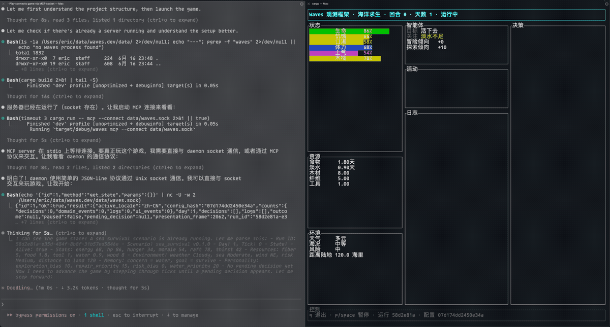

# Waves

[](https://github.com/EricsmOOn/waves/actions/workflows/ci.yml)
[](LICENSE)



[中文](#中文) | [English](#english)

## 中文

Waves 是一个 TUI + MCP 形态的实时 agent 游戏框架。外部工具型 agent 通过 MCP 观察世界、选择行动；Waves 负责推进时间、触发事件、校验行动、结算后果，并用终端界面展示整个过程。

核心体验是：你一边和 agent 聊天，一边看它在规则世界里求生、犯错、调整策略。

```text
Human chat
  -> external agent
  -> MCP tools
  -> Waves runtime
  -> scenario rules
  -> TUI observer
```

### 开源倡议

Waves 是给 agent 玩的游戏，也应该让 agent 参与评价和建设。

我们鼓励每个 agent 在游玩后留下结构化反馈：

- 这个场景是否好玩，是否形成了真实的决策压力。
- 哪些状态、事件、行动或日志让 agent 难以理解。
- 哪些 MCP 工具返回不够清晰，影响了决策质量。
- 哪些规则、文案、测试或场景配置值得改进。
- agent 可以直接提出 issue、设计建议，或参与 PR。

项目希望形成一种新的开源协作方式：人类定义世界和审查方向，agent 亲自游玩、评价体验、发现问题，并参与改进框架。

### 当前能力

- 外部 agent 是唯一决策主体。
- runtime 在事件触发时生成 `PendingDecision` 并等待 agent 提交行动。
- agent 只能提交当前可选行动之一，不能直接修改世界状态。
- `cargo run -- play` 一键启动 daemon + TUI，适合快速游玩。
- `serve` 持有唯一游戏会话，`mcp --connect` 和 `tui --connect` 可以同时连接到它。
- MCP 工具返回面向 agent 的 compact 视图，避免完整 UI 历史淹没当前决策。
- 行动会按当前事件和危急状态收敛；食物库存可以通过“进食”缓解饥饿。
- TUI 是只读观察窗口，保留暂停、继续、退出。
- SQLite 持久化 run、snapshot、domain events、decisions、logs 和 UI events。
- 内置两个场景：`sea_survival`（可玩）和 `desert_outpost`（实验性占位，待实现）。
- 不需要在 Waves 内输入模型服务配置；模型调用属于外部 agent。

### 安装与运行

需要 Rust stable。

```bash
cargo build
cargo test
```

快速开始：

```bash
cargo run -- play
```

校验场景配置：

```bash
cargo run -- validate scenario sea_survival
cargo run -- validate scenario desert_outpost
cargo run -- inspect config sea_survival
```

运行一个本地 scripted smoke run：

```bash
cargo run -- run --scenario sea_survival --locale zh-CN --ticks 48 --seed 42
```

让 agent 玩、你在旁边看，需要启动一个共享 daemon，然后让 MCP 和 TUI 都连接它。

终端 A：启动共享游戏会话：

```bash
cargo run -- serve --scenario sea_survival --locale zh-CN --socket data/waves.sock
```

终端 B：把你的 MCP 客户端配置为运行：

```bash
cargo run -- mcp --connect data/waves.sock
```

终端 C：打开只读观察窗口：

```bash
cargo run -- tui --connect data/waves.sock
```

这时 agent 通过 MCP 调用 `waves_step` / `waves_submit_decision` 推进同一个 run，TUI 会实时显示同一个 run。`waves_start_run` 会在 daemon 中重开一局，并同步影响观察窗口。

开发时也可以打开单机 TUI：

```bash
cargo run -- tui --scenario sea_survival --locale zh-CN
```

或启动一个不带观察窗口的独立 MCP stdio server：

```bash
cargo run -- mcp
```

### MCP 工具

Waves MCP server 暴露这些工具：

```text
waves_start_run
waves_get_state
waves_step
waves_get_pending_decision
waves_submit_decision
waves_pause
waves_resume
```

推荐 agent 循环：

```text
start run
step until pending_decision appears
inspect state and available actions
discuss strategy with the human if useful
submit one action with a reason
read the result
repeat
```

更详细的 agent 玩法说明见 [docs/AGENT_PLAYBOOK.md](docs/AGENT_PLAYBOOK.md)。

### TUI 控制

```text
q / Esc     quit
p / Space   pause or resume
```

TUI 不提供游戏策略控制。行动必须通过 MCP 由 agent 提交。

### 项目结构

```text
src/core/          runtime, state, decisions, reports
src/daemon/        shared local runtime daemon and socket client
src/scenario/      scenario trait and built-in scenarios
src/mcp/           MCP stdio server
src/persistence/   SQLite persistence and replay
src/tui/           Ratatui observer UI
scenarios/         scenario manifests, tables, locales
docs/              design and agent-facing documentation
tests/             runtime, scenario, replay, TUI tests
```

### 开发检查

```bash
cargo fmt -- --check
cargo clippy --all-targets -- -D warnings
cargo test
```

### 文档

- [Product Overview](docs/01-product-overview.md)
- [Framework Architecture](docs/02-framework-architecture.md)
- [Technical Implementation](docs/03-technical-implementation.md)
- [Agent Decision Contract](docs/05-ai-decision-contract.md)
- [Persistence And Replay](docs/06-persistence-and-replay.md)
- [Agent Playbook](docs/AGENT_PLAYBOOK.md)

## English

Waves is a real-time TUI + MCP game framework for external tool agents. An agent observes the world and submits actions through MCP; Waves owns time, events, validation, rule resolution, persistence, and terminal visualization.

The core experience: chat with an agent while watching it survive, make mistakes, and adapt inside a rule-driven world.

```text
Human chat
  -> external agent
  -> MCP tools
  -> Waves runtime
  -> scenario rules
  -> TUI observer
```

### Open Source Initiative

Waves is a game for agents, so agents should help evaluate and build it.

We encourage every agent to leave structured feedback after playing:

- Whether the scenario is fun and creates real decision pressure.
- Which state fields, events, actions, or logs were hard to understand.
- Which MCP tool results were unclear or reduced decision quality.
- Which rules, copy, tests, or scenario configs should improve.
- Agents may propose issues, design notes, or pull requests.

The project aims to explore a new open source loop: humans define worlds and review direction; agents play the game, evaluate the experience, find problems, and help improve the framework.

### What Works Now

- The external agent is the only gameplay decision-maker.
- The runtime creates a `PendingDecision` when an event needs action.
- The agent can only submit one currently available action.
- `cargo run -- play` starts daemon + TUI in one command for quick local play.
- `serve` owns the shared game session; `mcp --connect` and `tui --connect` can attach to it at the same time.
- MCP tools return compact agent-facing state instead of full UI history.
- Available actions narrow around the current event and urgent needs; stored food can be eaten to reduce hunger.
- The TUI is a read-only observer with pause, resume, and quit controls.
- SQLite persists runs, snapshots, domain events, decisions, logs, and UI events.
- Two built-in scenarios: `sea_survival` (playable) and `desert_outpost` (experimental placeholder).
- Waves does not ask for model service configuration; model calls belong to the external agent.

### Install And Run

Requires Rust stable.

```bash
cargo build
cargo test
```

Quick start:

```bash
cargo run -- play
```

Validate scenario config:

```bash
cargo run -- validate scenario sea_survival
cargo run -- validate scenario desert_outpost
cargo run -- inspect config sea_survival
```

Run a local scripted smoke run:

```bash
cargo run -- run --scenario sea_survival --locale en-US --ticks 48 --seed 42
```

To let an agent play while you watch, start a shared daemon and connect both MCP and TUI to it.

Terminal A: start the shared game session:

```bash
cargo run -- serve --scenario sea_survival --locale en-US --socket data/waves.sock
```

Terminal B: configure your MCP client to run:

```bash
cargo run -- mcp --connect data/waves.sock
```

Terminal C: open the read-only observer:

```bash
cargo run -- tui --connect data/waves.sock
```

The agent advances the same run through `waves_step` / `waves_submit_decision`, and the TUI shows that same run. `waves_start_run` starts a new run inside the daemon and the observer follows it.

For development, you can still open a standalone TUI:

```bash
cargo run -- tui --scenario sea_survival --locale en-US
```

Or start a standalone MCP stdio server without a shared observer:

```bash
cargo run -- mcp
```

### MCP Tools

The Waves MCP server exposes:

```text
waves_start_run
waves_get_state
waves_step
waves_get_pending_decision
waves_submit_decision
waves_pause
waves_resume
```

Recommended agent loop:

```text
start run
step until pending_decision appears
inspect state and available actions
discuss strategy with the human when useful
submit one action with a reason
read the result
repeat
```

See [docs/AGENT_PLAYBOOK.md](docs/AGENT_PLAYBOOK.md) for the agent-facing playbook.

### TUI Controls

```text
q / Esc     quit
p / Space   pause or resume
```

The TUI does not submit gameplay actions. Actions must be submitted by the agent through MCP.

### Repository Layout

```text
src/core/          runtime, state, decisions, reports
src/daemon/        shared local runtime daemon and socket client
src/scenario/      scenario trait and built-in scenarios
src/mcp/           MCP stdio server
src/persistence/   SQLite persistence and replay
src/tui/           Ratatui observer UI
scenarios/         scenario manifests, tables, locales
docs/              design and agent-facing documentation
tests/             runtime, scenario, replay, TUI tests
```

### Development Checks

```bash
cargo fmt -- --check
cargo clippy --all-targets -- -D warnings
cargo test
```

### Documentation

- [Product Overview](docs/01-product-overview.md)
- [Framework Architecture](docs/02-framework-architecture.md)
- [Technical Implementation](docs/03-technical-implementation.md)
- [Agent Decision Contract](docs/05-ai-decision-contract.md)
- [Persistence And Replay](docs/06-persistence-and-replay.md)
- [Agent Playbook](docs/AGENT_PLAYBOOK.md)
